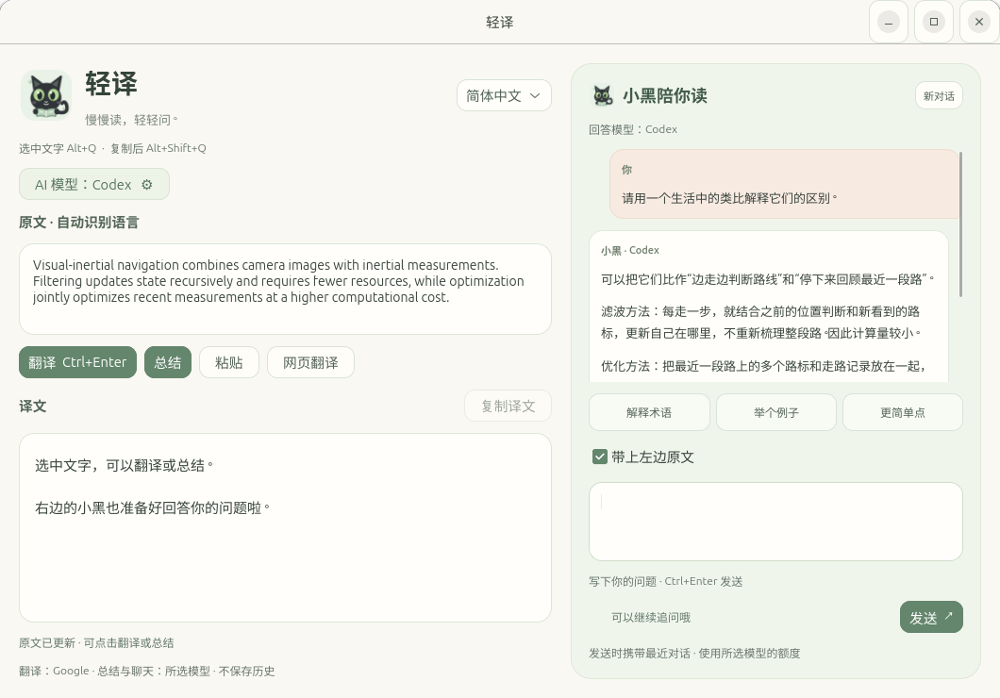

# 轻译 · 小黑陪你读

奶白与薄荷绿的小黑猫阅读助手。左侧划词翻译和 AI 总结，右侧随时提问、连续追问。
面向 Linux GNOME 桌面，使用 Python 3 和 GTK4，程序安装到当前用户目录。



## 安装

Ubuntu / Debian 的 GNOME 桌面需要 Python 3、PyGObject 和 GTK4。缺少依赖时可安装：

```bash
sudo apt install python3 python3-gi gir1.2-gtk-4.0 gir1.2-secret-1
```

下载或克隆源码后，在项目目录运行：

```bash
/usr/bin/python3 install.py
```

安装后在应用菜单搜索“轻译”。也可以不安装，直接运行：

```bash
/usr/bin/python3 qingyi.py
```

全局快捷键由 GNOME 注册；其他桌面可直接运行程序，但需要自行设置快捷键。
划词使用主选区，GNOME/Wayland 下通过 Xwayland 兼容。无法直接读取选中文字时，请用复制翻译。

## 使用

- **Alt+Q**：鼠标选中文字后按此快捷键，弹出译文。
- **Alt+Shift+Q**：先 Ctrl+C 复制，再按此快捷键翻译。适用于不提供选中文字的应用。
- 在应用菜单搜索 **轻译**，可以直接输入或粘贴原文。
- **Ctrl+Enter**：翻译输入内容。
- **总结** / **Ctrl+Shift+Enter**：用所选模型把原文提炼成概述和关键要点。
- **右侧聊天框**：填写问题，点击“发送”或在输入框内按 **Ctrl+Enter**，可连续追问。
- **Esc** 或关闭按钮：收起窗口。
- **Ctrl+Shift+Q**：完全退出。下次按全局快捷键会再次启动。
- 默认翻译成简体中文，可切换英文、日文、韩文，原文语言自动识别。
- 译文右上角提供复制按钮；网络连接失败时可点击“网页翻译”。

## 和小黑聊聊

右侧聊天与总结使用同一个模型设置，支持 Codex、DeepSeek 和自定义兼容 API。

- 勾选 **带上左边原文**：发送问题时附带当前原文，可以解释术语、举例、拆解句子。
- 取消勾选：不附带当前原文，发送问题与最近的对话，适合自由提问。
- **解释术语 / 举个例子 / 更简单点**：把示例问题填入输入框，点击“发送”后才会调用模型。
- **新对话**：清空当前对话并取消正在生成的回答。若想完全不携带之前的文档内容，请先开启新对话。
- 每条回答可以选择文字或点击 **复制回答**。
- 发送中可点击“取消”，迟到的回复不会进入新对话。

最近的对话只保留在本次运行的内存中，不写入聊天历史文件。发送时最多携带最近 6 轮对话，较长内容会进一步缩减。
勾选开关只控制此次是否附带左边原文；之前已发送的文档仍可能存在于对话上下文中。

## 选择 AI 模型

点击主窗口的 **AI 模型：… ⚙** 打开设置。

1. 选择 **DeepSeek** 或 **自定义 API（兼容 OpenAI）**。
2. DeepSeek 已填好官方 API 地址；自定义服务需要填入服务商的基础地址，例如 `https://服务商地址/v1`。
3. 输入服务商提供的 **API Key**，点击 **获取模型**，从返回的列表中选择模型。接口不提供列表时可手动输入模型 ID。
4. 点击 **保存并使用**，回到主窗口后点 **总结** 或在右侧提问。回答来自所选模型，窗口会显示当前模型名称。

模型名称从服务商 API 动态获取，不固定使用可能停用的旧模型 ID。
同类 OpenAI Chat Completions 兼容接口也可使用；本机服务支持 `http://localhost:端口/v1`。
切换输出语言后，点击“总结”生成对应语言的摘要，不会仅因切换语言自动发起收费的总结请求。
总结过程中可以点击“取消”，迟到的回复不会覆盖新结果。

**Codex（现有登录）** 无需 API Key，使用电脑上已登录的 Codex 账号；总结与提问会使用该账号额度。
此功能需要当前版本的 Codex CLI，或 Linux Codex 桌面应用自带的 CLI。没有 Codex 时，请在设置中选择 API 服务。
DeepSeek 和其他 API 的请求按所选服务商的规则计费，ChatGPT 订阅不会支付这些 API 请求。

API Key 可保存到系统钥匙串；取消勾选“保存 API Key”时仅本次运行使用，并清除该接口此前保存的 Key。
模型设置文件只保存服务地址、模型名和偏好，不保存 API Key。不要在聊天里发送自己的 Key，直接填进软件设置即可。

翻译需要联网，仅在主动请求翻译时向 Google 翻译服务发送原文。总结与聊天仅在主动请求时向所选模型服务发送相关内容。
程序不后台监听剪贴板，不额外保存翻译、总结或对话历史；服务商的数据处理规则由所选服务商决定。
使用的是未提供稳定性保证的公开网页翻译接口，服务变化时可能需要调整程序。
一次最多翻译 5000 字、总结或附带原文 30000 字、提问 5000 字。截图和扫描 PDF 需要先提取文字；此版本没有 OCR。
部分应用或 Wayland 场景不提供主选区，请使用复制翻译；没有选区时不会自动发送剪贴板内容。

## 安装位置

- 程序：`~/.local/share/qingyi/`
- 启动器：`~/.local/bin/qingyi`
- 应用菜单：`~/.local/share/applications/io.local.Qingyi.desktop`
- 两个快捷键保存在 GNOME 自定义快捷键中，名称以“轻译”开头。
- 模型设置：`~/.config/qingyi/models.json`；API Key 保存在系统钥匙串中。
- 不加入开机自启动；首次使用后保留一个小进程以便快速打开。

重新安装：在本文件所在目录运行 `/usr/bin/python3 install.py`。

卸载：运行 `/usr/bin/python3 ~/.local/share/qingyi/install.py --uninstall`。
卸载删除轻译自己的文件、模型设置、钥匙串中的 API Key 和快捷键，不改动已有其他快捷键。

源代码入口为 `qingyi.py`，可直接运行 `/usr/bin/python3 qingyi.py`。

## 开发验证

网络接口与凭据处理测试使用本地模拟服务，不需要真实 API Key：

```bash
/usr/bin/python3 -m unittest discover -s tests -v
```

黑猫图标位于 `assets/black-cat.svg`，界面和模型设置使用原生 GTK4。个人模型配置和 API Key 不包含在仓库中。
